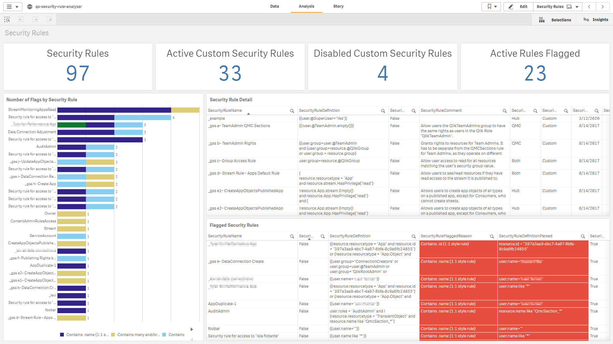

# Status

# qs-security-rule-analyzer

The **qs-security-rule-analyzer** application is an application supported by the Americas Enterprise Architecture team from Qlik. It is a very straight forward application that makes to calls to the QRS (repository database) that fetches metadata around custom properties and all security rule information. The application itself takes advantage of the existing `monitor_apps_REST_app` data connection, so there is no installer and it is plug and play, spare a couple of variable settings and ensuring that the user executing the reload has _RootAdmin_ rights and access to the data connection. Complete setup instructions can be found in the script.

\*_Note that this application was designed for use alongside the Qlik Sense Admin Playbook (link to come, as still in development)._

Download here: [Releases](https://github.com/eapowertools/qs-security-rule-analyzer/releases)

Screenshot

